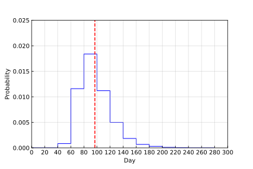

# 化石コンプリートまでの日数計算

どうぶつの森で化石を全種類コンプリートするまでにどのくらい日数が必要なのか見積もりをした．

## 計算条件
- 化石は78種類
- １日に4個の化石が採れる
- 化石をコンプリートするまで毎日4個の化石を採る
- 1万回試行して化石コンプリートの日数を記録する

## 計算結果

横軸: 化石をコンプリートできた日数\
縦軸: 相対頻度\
平均:96.6（グラフ中の赤線）\
標準偏差:24.5
